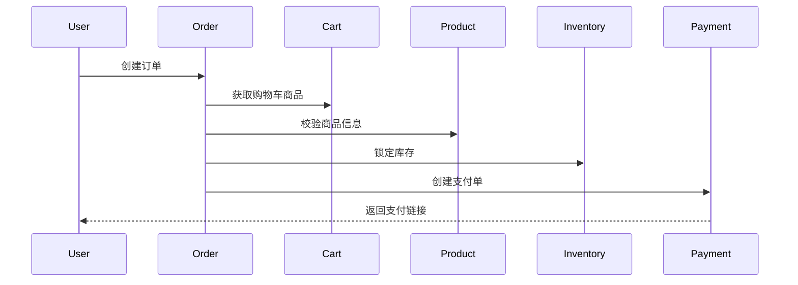
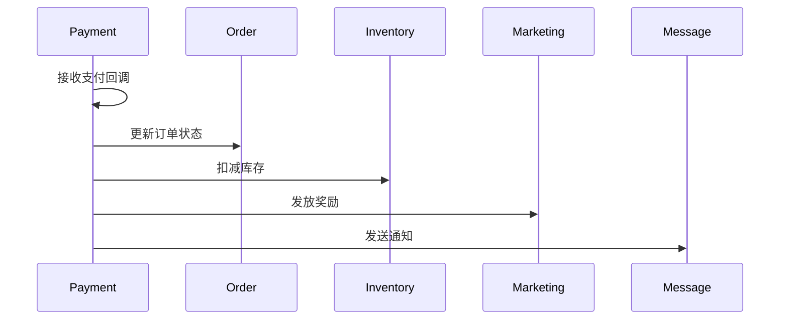

# gozero-ecommerce
an ecommerce system written in go zero.
# GoZero电商平台

基于go-zero微服务框架实现的分布式电商系统。

## 技术栈

- 开发框架: go-zero
- 数据库: MySQL
- 缓存: Redis 
- 消息队列: RabbitMQ
- 服务发现与配置: etcd
- 链路追踪: Jaeger
- 监控告警: Prometheus

## 系统架构

### 微服务划分

1. 用户服务 (User Service)
   - 用户管理
   - 地址管理
   - 钱包功能
   
2. 商品服务 (Product Service) 
   - 商品管理
   - 分类管理
   - SKU管理
   - 评价管理

3. 订单服务 (Order Service)
   - 订单管理
   - 订单状态流转
   - 支付集成
   - 退款管理

4. 购物车服务 (Cart Service)
   - 购物车管理
   - 商品选择
   - 价格计算

5. 库存服务 (Inventory Service)  
   - 库存管理
   - 库存锁定
   - 库存预警

6. 支付服务 (Payment Service)
   - 支付渠道管理
   - 支付订单处理
   - 退款处理

7. 营销服务 (Marketing Service)
   - 优惠券管理
   - 促销活动
   - 积分系统

8. 消息服务 (Message Service)
   - 消息模板
   - 消息发送
   - 批量通知

### 核心业务流程

1. 下单流程


2. 支付流程


### RabbitMQ事件总线设计

主要Exchange和Queue：

1. 订单相关

* `order.created`: 订单创建事件
* `order.payment`: 订单支付事件
* `order.cancel`: 订单取消事件
* `order.shipped`: 订单发货事件
* `order.received`: 订单确认收货事件

2. 支付相关

* `payment.created`: 支付单创建事件
* `payment.success`: 支付成功事件
* `payment.failed`: 支付失败事件
* `payment.refund`: 退款事件

3. 库存相关

* `inventory.lock`: 库存锁定事件
* `inventory.update`: 库存更新事件
* `inventory.alert`: 库存预警事件

4. 营销相关

* `marketing.coupon`: 优惠券事件
* `marketing.points`: 积分事件
* `marketing.promotion`: 促销活动事件

5. 消息相关
* `message.event`: 消息发送事件
* `message.template`: 模板变更事件
* `message.batch`: 批量消息事件

## 快速开始

### 环境要求

* Go 1.16+
* MySQL 5.7+
* Redis 6.0+
* RabbitMQ 3.8+
* etcd 3.4+

```bash
docker run --name my-mysql -e MYSQL_ROOT_PASSWORD=pa55word -d -p 3306:3306 mysql:latest
docker run --name my-redis -d -p 6379:6379 redis
docker run -d --name rabbitmq -p 5672:5672 -p 15672:15672 rabbitmq:management
```

### 服务启动

1. 配置修改
```bash
vim .../user/etc/user.yaml
vim .../product/etc/product.yaml
...
```

2. 数据库初始化
```bash
mysql -uroot -ppa55word < /sql/inventory.sql
mysql -uroot -ppa55word < /sql/cart.sql
mysql -uroot -ppa55word < /sql/marketing.sql
mysql -uroot -ppa55word < /sql/message.sql
mysql -uroot -ppa55word < /sql/order.sql
mysql -uroot -ppa55word < /sql/payment.sql
mysql -uroot -ppa55word < /sql/product.sql
mysql -uroot -ppa55word < /sql/user.sql
```

3. 启动服务

* **后端**

```bash
# 按照依赖启动各个微服务
go run user.go -f etc/user.yaml
go run product.go -f etc/product.yaml

# 启动API网关
go run mall.go -f etc/mall-api.yaml
...
```

* **前端**

```bash
# 安装依赖
pnpm install
pnpm dev
```

## 项目结构

```
├── application        // API网关
├── cart              // 购物车服务
├── inventory         // 库存服务  
├── marketing         // 营销服务
├── message           // 消息服务
├── order            // 订单服务
├── payment          // 支付服务
├── product          // 商品服务
└── user             // 用户服务
```

每个微服务目录结构:
```
├── api              // API定义
├── etc             // 配置文件 
├── internal        // 内部实现
│   ├── config      // 配置结构
│   ├── handler     // 接口处理
│   ├── logic       // 业务逻辑
│   ├── svc         // 依赖注入
│   └── types       // 类型定义
├── model           // 数据模型
└── rpc             // RPC服务
```